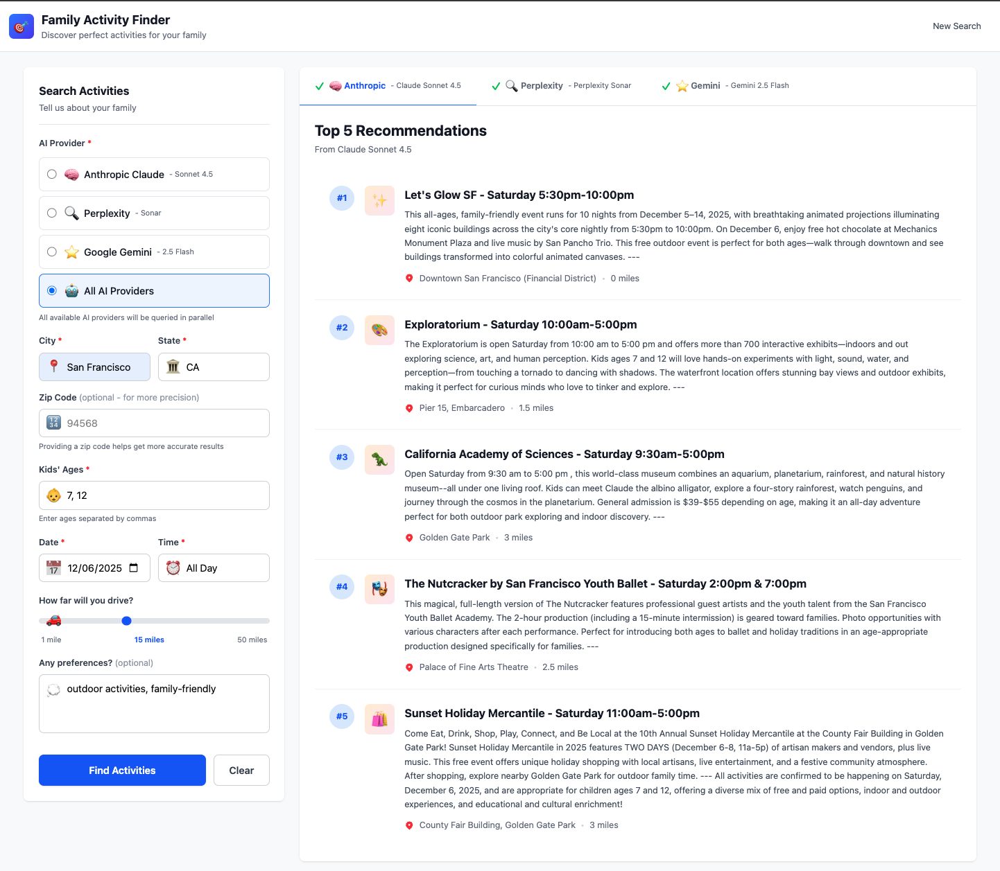
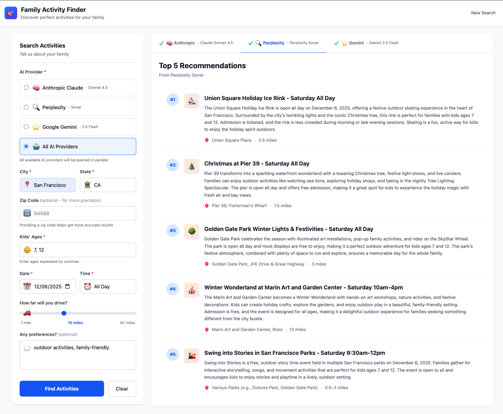
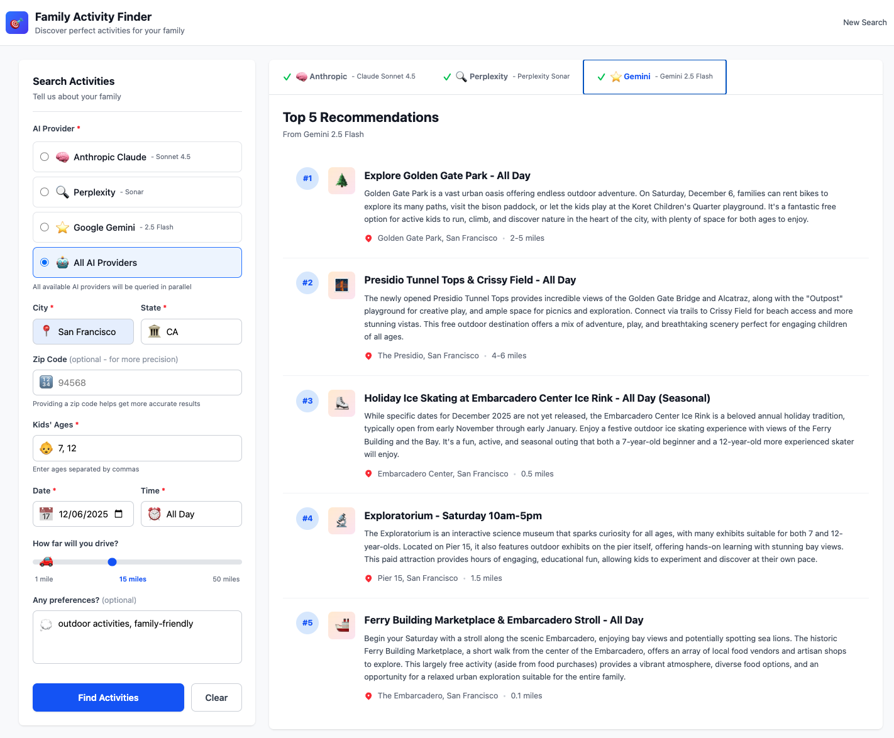

# 🎯 Family Activity Finder

Discover personalized family-friendly activities using AI-powered web search. Built with React, TypeScript, and Claude AI.



## ✨ Features

- 🤖 **Multi-LLM Provider Support** - Choose from Anthropic Claude, Perplexity, or Google Gemini
- 🔄 **Parallel Multi-Provider Queries** - Query all available providers simultaneously for comparison
- 🔍 **Real-Time Web Search** - All providers support web search for current, accurate activity data
- 🗺️ **Precise Location Search** - City, state, and optional zip code for accurate results
- 📅 **Smart Date Selection** - HTML5 date picker with automatic weekend detection
- ⏰ **Flexible Time Slots** - All Day, Morning, Afternoon, Evening, or Night
- 🎨 **Modern UI** - Clean, responsive design with Tailwind CSS
- 🔒 **Secure Architecture** - API keys protected server-side, proper CORS configuration
- ⚡ **Fast Performance** - Sub-20 second response times with web search

## 🚀 Quick Start

### Prerequisites

- Node.js 18+ and npm
- At least one LLM provider API key:
  - **Anthropic Claude** ([Get one here](https://console.anthropic.com/)) - Default provider
  - **Perplexity** ([Get one here](https://www.perplexity.ai/api-platform/)) - Optional
  - **Google Gemini** ([Get one here](https://ai.google.dev/)) - Optional

### Installation

1. **Clone the repository**

   ```bash
   git clone https://github.com/shrimpy8/family-activity-finder.git
   cd family-activity-finder
   ```

2. **Set up Backend**

   ```bash
   cd backend
   npm install
   ```

3. **Configure environment variables**

   ```bash
   # Create .env file in backend directory
   cp .env.example .env
   ```

   Edit `backend/.env` and add your API keys (at least one required):

   ```env
   # Required: At least one provider API key
   ANTHROPIC_API_KEY=your_anthropic_api_key_here
   
   # Optional: Additional providers
   PERPLEXITY_API_KEY=your_perplexity_api_key_here
   GEMINI_API_KEY=your_gemini_api_key_here
   
   # Server configuration
   PORT=3001
   ```

4. **Set up Frontend**

   ```bash
   cd ../frontend
   npm install
   ```

5. **Start the application**

   Open two terminal windows:

   **Terminal 1 - Backend:**

   ```bash
   cd backend
   npm run dev
   ```

   **Terminal 2 - Frontend:**

   ```bash
   cd frontend
   npm run dev
   ```

6. **Open your browser**

   Navigate to `http://localhost:5173`

## 📖 Usage

1. **Select AI Provider**: Choose your preferred LLM provider (defaults to Anthropic Claude Sonnet 4.5) or select "All AI Providers" to query all available providers in parallel
2. **Enter Location**: City, state (required), and optional zip code for precision
3. **Specify Ages**: Enter children's ages separated by commas (e.g., "5, 8, 12")
4. **Select Date**: Choose a date using the calendar picker
5. **Choose Time**: Pick a time slot (All Day, Morning, Afternoon, Evening, or Night)
6. **Set Distance**: Use the slider to set how far you're willing to drive (1-50 miles)
7. **Add Preferences** (Optional): Enter any specific requirements (e.g., "outdoor, educational, free")
8. **Click "Find Activities"**: Wait 10-20 seconds for AI-powered recommendations

**Note**: When using "All AI Providers", results from each provider are displayed in separate tabs, allowing you to compare recommendations side-by-side.



### Available Providers

- **Anthropic Claude Sonnet 4.5** (Default)
  - Model: Claude Sonnet 4.5
  - Web Search: ✅ Native support via web_search tool
  - Best for: High-quality, detailed recommendations with citations

- **Perplexity Sonar**
  - Model: Perplexity Sonar
  - Web Search: ✅ Built-in real-time web search
  - Best for: Fast, citation-backed results

- **Google Gemini 2.5 Flash**
  - Model: Gemini 2.0 Flash
  - Web Search: ⚠️ Limited (may use grounding features)
  - Best for: General recommendations (web search capabilities may vary)

- **All AI Providers** (Parallel Query)
  - Queries all available providers simultaneously
  - Results displayed in tabbed interface for easy comparison
  - Individual provider failures don't affect other providers
  - Best for: Comparing recommendations across different AI models



## 🏗️ Project Structure

```text
family-activity-finder/
├── frontend/                 # React + TypeScript frontend
│   ├── src/
│   │   ├── components/      # React components
│   │   │   ├── ActivityForm.tsx
│   │   │   ├── RecommendationCard.tsx
│   │   │   └── MultiProviderResults.tsx
│   │   ├── services/        # API integration
│   │   │   └── api.ts
│   │   ├── types/           # TypeScript definitions
│   │   │   └── index.ts
│   │   ├── utils/           # Utility functions
│   │   │   ├── date.ts
│   │   │   └── providerIcons.tsx
│   │   ├── App.tsx          # Main app component
│   │   └── main.tsx         # Entry point
│   ├── package.json
│   └── .env                 # Frontend config (optional)
│
├── backend/                  # Express + TypeScript backend
│   ├── src/
│   │   ├── routes/          # API routes
│   │   │   └── recommend.ts # Main recommendation endpoints
│   │   ├── services/       # Service layer
│   │   │   └── llm-providers/  # LLM provider implementations
│   │   │       ├── AnthropicProvider.ts
│   │   │       ├── PerplexityProvider.ts
│   │   │       ├── GeminiProvider.ts
│   │   │       ├── factory.ts
│   │   │       └── types.ts
│   │   ├── shared/         # Shared utilities and types
│   │   │   ├── constants/
│   │   │   ├── types/
│   │   │   ├── utils/
│   │   │   │   ├── sanitize.ts
│   │   │   │   └── timeout.ts
│   │   │   └── validators/
│   │   ├── types/           # TypeScript definitions
│   │   │   └── index.ts
│   │   └── index.ts         # Express server setup
│   ├── package.json
│   ├── .env                 # Backend config (API keys)
│   └── .env.example         # Template for .env
│
├── .claude/                  # Claude Code settings
│   └── settings.local.json
├── backend/
│   ├── docs/                 # Backend documentation
│   │   └── SECURITY.md       # Security documentation
│   └── ...
├── frontend/
│   ├── docs/                 # Frontend documentation
│   │   └── README.md         # Frontend setup guide
│   └── ...
├── prompt.md                 # Claude API prompt documentation (referenced by code)
├── spec.md                   # Original project specification
├── todo.md                   # Development milestones & tasks
├── docs/                     # Documentation and assets
│   └── images/              # Screenshots and images
│       ├── anthropic-results.png
│       ├── perplexity-results.png
│       └── gemini-results.png
└── README.md                 # This file
```

## 🔧 Technology Stack

### Frontend

- **React 19** - UI framework
- **TypeScript** - Type safety
- **Tailwind CSS 4** - Styling
- **Vite** - Build tool and dev server

### Backend

- **Node.js** - Runtime
- **Express 5** - Web framework
- **TypeScript** - Type safety
- **Anthropic SDK** - Claude AI integration
- **Google Generative AI SDK** - Gemini AI integration
- **Perplexity API** - Perplexity AI integration (via fetch)
- **dotenv** - Environment variable management
- **cors** - Cross-origin resource sharing

## 🎨 Key Components

### ActivityForm.tsx

- LLM provider selection with radio buttons (Anthropic, Perplexity, Gemini, or All)
- Model names displayed for each provider
- Smart default date (next weekend or today if already weekend)
- Real-time input validation
- Responsive design optimized for mobile and desktop

### RecommendationCard.tsx

- Displays emoji, title, location, distance, and description
- Hover effects for better UX
- Numbered badges for easy reference

### MultiProviderResults.tsx

- Tabbed interface for viewing results from multiple providers
- Individual provider success/error states with visual indicators
- Loading indicators per provider
- Expandable error details for debugging
- Seamless switching between provider results

### API Service (backend/src/routes/recommend.ts)

- Multi-provider support via factory pattern
- Two endpoints: `/api/recommend` (single provider) and `/api/recommend/all` (parallel queries)
- Builds dynamic prompts from form data
- Calls selected LLM provider API with web search enabled
- Parses AI responses into structured recommendations
- Comprehensive error handling and provider validation
- Parallel query support with Promise.allSettled for fault tolerance

## 🔐 Environment Variables

### Backend (.env)
```bash
# Required: At least one provider API key
ANTHROPIC_API_KEY=sk-ant-...           # Anthropic Claude API key (default provider)
PERPLEXITY_API_KEY=pplx-...            # Optional: Perplexity API key
GEMINI_API_KEY=...                     # Optional: Google Gemini API key

# Server configuration
PORT=3001                              # Optional: Server port (default: 3001)
FRONTEND_URL=https://yourdomain.com    # Optional: Production frontend URL (comma-separated for multiple)
DEBUG_LOGGING=false                    # Optional: Enable verbose logging

# Backend-only configuration
OUTPUT_FORMAT=markdown                 # Optional: LLM output format (markdown or json, default: markdown)
```

### Frontend (.env) - Optional

```bash
VITE_API_URL=http://localhost:3001    # Backend URL (default: http://localhost:3001)
```

## 🛣️ API Endpoints

### `POST /api/recommend`

Generates activity recommendations using Claude AI with web search.

**Request Body:**
```json
{
  "city": "Dublin",
  "state": "CA",
  "zipCode": "94568",
  "ages": [5, 8],
  "date": "2025-11-16",
  "timeSlot": "afternoon",
  "distance": 10,
  "preferences": "outdoor activities, family-friendly",
  "provider": "anthropic"
}
```

**Request Parameters:**

- `provider` (optional): LLM provider to use (`"anthropic"`, `"perplexity"`, or `"gemini"`). Defaults to `"anthropic"`.

**Response:**

```json
{
  "recommendations": [
    {
      "emoji": "🎨",
      "title": "Children's Art Workshop - Saturday 2pm-4pm",
      "location": "Downtown Dublin",
      "distance": "2 miles",
      "description": "Interactive art workshop for kids ages 4-10..."
    }
  ]
}
```

### `POST /api/recommend/all`

Fetches activity recommendations from all available AI providers in parallel. Uses `Promise.allSettled` to ensure all providers are queried even if some fail.

**Request Body:**

```json
{
  "city": "Dublin",
  "state": "CA",
  "zipCode": "94568",
  "ages": [5, 8],
  "date": "2025-11-16",
  "timeSlot": "afternoon",
  "distance": 10,
  "preferences": "outdoor activities, family-friendly"
}
```

**Note:** The `provider` field should NOT be included in the request body for this endpoint.

**Response:**

```json
[
  {
    "provider": "anthropic",
    "modelName": "Claude Sonnet 4.5",
    "recommendations": [
      {
        "emoji": "🎨",
        "title": "Children's Art Workshop - Saturday 2pm-4pm",
        "location": "Downtown Dublin",
        "distance": "2 miles",
        "description": "Interactive art workshop for kids ages 4-10..."
      }
    ]
  },
  {
    "provider": "perplexity",
    "modelName": "Perplexity Sonar",
    "recommendations": [...]
  },
  {
    "provider": "gemini",
    "modelName": "Gemini 2.5 Flash",
    "error": "API request failed",
    "fullErrorResponse": {...}
  }
]
```

**Error Handling:**

- Individual provider failures don't fail the entire request
- Failed providers return an `error` field with sanitized error messages
- Successful providers still return their recommendations
- Use case: Compare recommendations across different AI models side-by-side

### `GET /health`

Health check endpoint.

**Response:**

```json
{
  "status": "ok",
  "timestamp": "2025-11-15T15:03:54.804Z"
}
```

## 🔒 Security

Family Activity Finder implements enterprise-grade security to protect your data and prevent API abuse. **See [SECURITY.md](./backend/docs/SECURITY.md) for complete security documentation.**

### Security Features

✅ **CORS Protection** - API restricted to authorized frontend origin only
✅ **Rate Limiting** - 10 requests per 15 minutes per IP address
✅ **Request Size Limits** - 10KB maximum payload to prevent memory attacks
✅ **Input Validation** - Comprehensive validation on all 8 form fields
✅ **Security Headers** - Helmet.js with 8 security headers (CSP, HSTS, X-Frame-Options, etc.)
✅ **Error Sanitization** - No internal details exposed to clients
✅ **API Key Security** - Keys stored server-side only, never in frontend
✅ **npm Audit** - 0 vulnerabilities in both backend and frontend

### Rate Limits

- **Limit:** 10 requests per 15 minutes per IP
- **Response:** HTTP 429 when exceeded
- **Reset:** Automatic after 15-minute window
- **Headers:** `RateLimit-*` headers included in all responses

### CORS Configuration

- **Development:** `http://localhost:5173`
- **Production:** Set via `FRONTEND_URL` environment variable
- **Unauthorized origins:** Blocked with CORS error

### Security Testing

All security features comprehensively tested:

- ✅ CORS blocks unauthorized origins
- ✅ Rate limiter verified with stress test (12 requests)
- ✅ Oversized payloads rejected (15KB test)
- ✅ SQL injection attempts blocked
- ✅ XSS attempts sanitized
- ✅ All 8 security headers verified active

### Production Environment Variables

**Backend:**

```bash
ANTHROPIC_API_KEY=sk-ant-...           # Production API key
PORT=3001                              # Server port
FRONTEND_URL=https://yourdomain.com    # Production frontend URL
NODE_ENV=production                    # Environment mode
```

**Frontend:**

```bash
VITE_API_URL=https://api.yourdomain.com  # Production backend URL
```

**📖 Full documentation:** [SECURITY.md](./backend/docs/SECURITY.md)

---

## 🎯 Development Milestones

- ✅ **Milestone 1**: Frontend with dummy data (Complete)
- ✅ **Milestone 2**: Claude API integration with web search (Complete)
- ✅ **Milestone 3**: Production security & deployment (Complete - 11/15 core tasks)
- ✅ **Milestone 4**: Multi-provider support with parallel queries (Complete)

See [todo.md](./todo.md) for detailed task breakdowns.

## 🚀 Future Enhancements

- 🔗 **Website URLs** - Display primary website URLs for each recommendation (e.g., museum websites, event pages)
  - URLs will be extracted from LLM responses and validated
  - Clickable links in recommendation cards
  - Graceful handling when URLs are unavailable

## 🐛 Troubleshooting

### Backend won't start

- **Solution**: Check that `ANTHROPIC_API_KEY` is set in `backend/.env`
- **Solution**: Ensure port 3001 is not already in use

### CORS errors

- **Solution**: Verify backend is running on port 3001
- **Solution**: Check that `cors()` middleware is enabled in `backend/src/index.ts`

### Frontend shows "Failed to load recommendations"

- **Solution**: Verify backend is running (`http://localhost:3001/health` should return status)
- **Solution**: Check browser console for specific error messages
- **Solution**: Ensure API key is valid and has credits

### Claude API errors

- **Solution**: Verify API key is correct and active
- **Solution**: Check you have available API credits
- **Solution**: Ensure you're using the correct model name: `claude-sonnet-4-5-20250929`

### Web search not working

- **Solution**: Verify tools configuration includes `type: 'web_search_20250305'`
- **Solution**: Check that `max_uses: 5` is set for the web search tool

### Rate Limit Errors (HTTP 429)

- **Problem**: "Too many requests from this IP, please try again after 15 minutes"
- **Solution**: Wait for the rate limit window to reset (check `RateLimit-Reset` header)
- **Solution**: Reduce request frequency (current limit: 10 requests per 15 minutes)
- **Note**: This is expected behavior to prevent API abuse

### CORS Blocked from Different Domain

- **Problem**: CORS error when accessing API from unauthorized origin
- **Solution**: Update `FRONTEND_URL` in backend `.env` to your frontend domain
- **Solution**: For development, ensure frontend is running on `http://localhost:5173`
- **Note**: This is a security feature, not a bug

### Request Too Large (HTTP 413)

- **Problem**: "Payload Too Large" error
- **Solution**: Ensure request body is under 10KB
- **Solution**: Reduce length of preferences field (max 500 characters)
- **Note**: Size limit prevents memory exhaustion attacks

### Invalid Input Errors (HTTP 400)

- **Problem**: Input validation failing with specific error messages
- **Solution**: Check field requirements in error message
- **Common issues:**
  - City: Only letters, spaces, hyphens, apostrophes, periods allowed
  - State: Must be valid 2-letter US state code (e.g., CA, NY, TX)
  - ZipCode: Must be exactly 5 digits
  - Ages: Must be integers between 0-18
  - Date: Must be YYYY-MM-DD format within 1 year from today
  - Distance: Must be between 1-50 miles

## 📝 Development Scripts

### Backend

```bash
npm run dev      # Start development server with hot reload
npm run build    # Build TypeScript to JavaScript
npm start        # Run production build
```

### Frontend

```bash
npm run dev      # Start Vite dev server
npm run build    # Build for production
npm run preview  # Preview production build
npm run lint     # Run ESLint
```

## 🤝 Contributing

This is a personal project built as part of learning AI integration. Feel free to fork and experiment!

## 📄 License

ISC

## 🙏 Acknowledgments

**Project Inspiration**: This project was inspired by [Peter Yang's podcast episode "Full Tutorial: 20 Tips to Master Claude Code"](https://www.youtube.com/watch?v=jWlAvdR8HG0&list=PLYjaE5GkSwx4yBt6N51P98PyDuGTzWqjK&index=6). The tutorial's core concept served as the foundation, which I then extended with additional features including enhanced security, production-ready architecture, comprehensive input validation, and improved UI/UX.

- Built with [Claude Code](https://claude.com/code)
- Powered by [Anthropic's Claude API](https://www.anthropic.com/)
- UI framework: [React](https://react.dev/)
- Styling: [Tailwind CSS](https://tailwindcss.com/)

## 📚 Additional Documentation

- [prompt.md](./prompt.md) - Claude API prompt template and implementation guide
- [spec.md](./spec.md) - Original project specification
- [todo.md](./todo.md) - Development milestones and task tracking

---

**Built with ❤️ using Claude Code**
